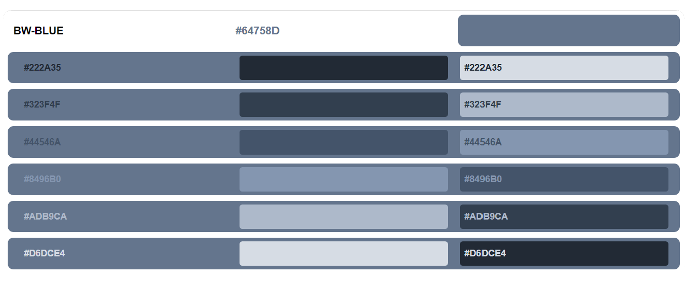

# Write HTML Code with Python Library: Airium

## Colors picking method:
Colors are picked from Microsoft Word using software called [jpicker](github.com/stanford-gfx/jpicker). Some colors in Grayscale color group have been changed from the original data because in the original data some colors are red dominant.
I have added both the original data and the modified data to this repo:
- [Original Data]()
- [Changed Data (used in this repo)]()
## Microsoft Word Standard Color Table
#### *cells that are marked with (AVG) are the average color from their colors group.
BW|BW-BLUE|BLUE|ORANGE|GRAY|YELLOW|BLUE2|GREEN
|-|-|-|-|-|-|-|-|
|000000|222A35|1F3864|833C0B|525252|7F6000|1E4E79|375623
|0C0C0C|323F4F|2F5496|C55A11|7B7B7B|BF9000|2E75B5|538135
|171616|44546A|4472C4|ED7D31|A5A5A5|FFC000|5B9BD5|70AD47
|262626|8496B0|8EAADB|F4B183|C9C9C9|FFD965|9CC3E5|A8D08D
|383838|ADB9CA|B4C6E7|F7CBAC|DBDBDB|FEE599|BDD7EE|C5E0B3
|3F3F3F|D6DCE4|D9E2F3|FBE5D5|EDEDED|FFF2CC|DEEBF6|E2EFD9
|595959|(AVG)64758D|(AVG)698ECF|(AVG)F0975A|B7B7B7|(AVG)FFCC32|(AVG)7BACDD|(AVG)8CBE6A
707070
7F7F7F
A5A5A5
ABABAB
BFBFBF
CECECE
D8D8D8
E6E6E6
F2F2F2
FFFFFF
(AVG)929292

## Web Guide

- The color of the text used is following the content of the text.
- The background color that is used is an inversion of text color.
- The background container color is written beside the colors group name.
- In the `second column` color that is used follows the text color in the `first column`.

## For example in the image above:
- in `column 1 row 1`, [#222A35] is the text content, and the text color is [#222A35]().
- in `column 3 row 1`,  the text color is follows column 1 line 1, and the background color uses the opposite, i.e. [#D6DCE4]()(`column 6 row 3`).
- in `rows 1 to 6`, use the same background color [#64758D] as written next to the color group name
- in `column 2 row 1`, the color that is used is [#222A35]() equals to the color and text in `column 1`.
