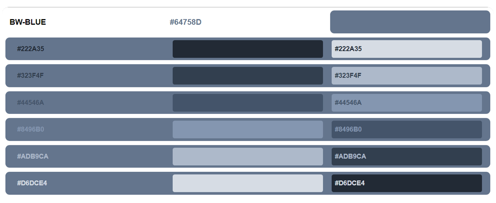

# Menulis Code HTML Menggunakan Library Python Airium

## Metode pengambilan warna:
Warna diambil dari Microsoft Word menggunakan software [jpicker](github.com/stanford-gfx/jpicker). Beberapa warna yang ada dalam group `Graycscale` telah diubah dari data asli karena pada data asli terdapat warna yang sedikit dominan ke warna merah.
Baik data asli maupun data yang diubah sudah saya tambahkan ke dalam repo ini:
- [Data Asli](microsoft_word_standard_colors_original_data.csv)
- [Data yang sudah diubah (digunakan saat ini)](microsoft_word_standard_colors_data.csv)
## Microsoft Word Standard Color Table
#### *sel yang ditandai (AVG) adalah warna rata-rata dari color groupnya.
BW|BW-BLUE|BLUE|ORANGE|GRAY|YELLOW|BLUE2|GREEN
|-|-|-|-|-|-|-|-|
|000000|222A35|1F3864|833C0B|525252|7F6000|1E4E79|375623
|0C0C0C|323F4F|2F5496|C55A11|7B7B7B|BF9000|2E75B5|538135
|171616|44546A|4472C4|ED7D31|A5A5A5|FFC000|5B9BD5|70AD47
|262626|8496B0|8EAADB|F4B183|C9C9C9|FFD965|9CC3E5|A8D08D
|383838|ADB9CA|B4C6E7|F7CBAC|DBDBDB|FEE599|BDD7EE|C5E0B3
|3F3F3F|D6DCE4|D9E2F3|FBE5D5|EDEDED|FFF2CC|DEEBF6|E2EFD9
|595959|(AVG)64758D|(AVG)698ECF|(AVG)F0975A|B7B7B7|(AVG)FFCC32|(AVG)7BACDD|(AVG)8CBE6A
707070
7F7F7F
A5A5A5
ABABAB
BFBFBF
CECECE
D8D8D8
E6E6E6
F2F2F2
FFFFFF
(AVG)929292

## Petunjuk Web
- Warna teks yang digunakan sesuai dengan isi teks.
- Warna background yang digunakan adalah warna kebalikan dari warna teks.
- Warna background container tertulis di samping nama color group.
- Pada `kolom 2` warna yang digunakasn sama dengan warna teks pada `kolom 1`.

## Misal pada gambar di atas:
- pada `kolom 1 baris 1`, `#222A35` adalah isi teks, dan warna teksnya adalah `#222A35`.
- pada `kolom 3 baris 1`, text menggunakan warna `#222A35]`  dan background menggunakan kebalikannya yaitu `#D6DCE4`(`kolom6 baris 3`).
- Pada `baris 1 sampai baris 6`, menggunakan warna background yang sama yaitu `64758D` sebagaimana tertulis di samping nama color group.
- Pada `kolom 2 baris 1` warna yang digunakan adalah `#222A35`  sama dengan warna dan teks pada `kolom 1`.

